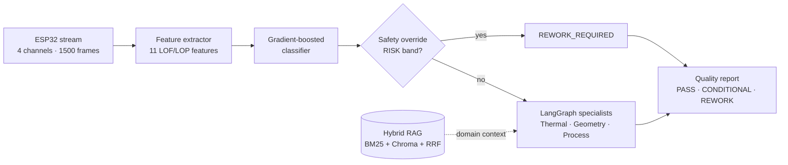

<div align="center">

# WarpSense


&nbsp;


**Multi-agent weld-quality system** — catches Lack-of-Fusion / Lack-of-Penetration defects from a 4-channel ESP32 sensor stream, reasons against AWS D1.1 / ISO 5817 / IACS Rec.47 via hybrid RAG, and returns a structured disposition with corrective actions.

**FNR = 0.000 across all 24 eval scenarios — no LOF/LOP defect was ever missed.**

<!-- 📸 HIGHEST-IMPACT TODO: paste a UI screenshot or demo GIF on the line below — a recruiter looks at an image before reading a word.   e.g.    -->

</div>

> Every architecture decision here is measured, not assumed. Three things worth talking through: why **FNR, not F1**, gates this system; how a **measured retrieval number** justified rebuilding the RAG layer; and how a design review **killed the first version of my next-phase plan** before I wrote a line of it.

---

## Architecture


```mermaid
flowchart LR
    A[ESP32 stream<br/>4 channels · 1500 frames] --> B[Feature extractor<br/>11 LOF/LOP features]
    B --> C[Gradient-boosted<br/>classifier]
    C --> D{Safety override<br/>RISK band?}
    D -->|yes| E[REWORK_REQUIRED]
    D -->|no| F[LangGraph specialists<br/>Thermal · Geometry · Process]
    G[(Hybrid RAG<br/>BM25 + Chroma + RRF)] -. domain context .-> F
    F --> H[Quality report<br/>PASS · CONDITIONAL · REWORK]
    E --> H
```

The deterministic **safety override** sits between the classifier and the LLM layer — it alone can force `REWORK_REQUIRED`, which is why no LLM failure ever produces a missed defect.

---

## The system in three phases

### Phase 1 — Deterministic core (rule-based + gradient-boosted)

`session_feature_extractor.py` turns 1500 raw frames into 11 LOF/LOP features (heat input, torch-angle drift, arc stability). A gradient-boosted classifier (sklearn `GradientBoostingClassifier`) predicts GOOD / MARGINAL / DEFECTIVE with per-class confidence and the top-3 driving features.

Underneath everything sits a **deterministic safety override**: if any threshold violation lands in the RISK band, the disposition is `REWORK_REQUIRED` regardless of what any model says. That floor is what holds FNR at 0.000.

- Feature separation validated: `heat_diss_max_spike` shows an **18× gap** expert → novice; 8 of 11 features separate cleanly.
- Why boosted trees, not neural: no labelled data at this scale, and `feature_importances_` is inspectable — a quality engineer can move a threshold without retraining.

### Phase 2 — Multi-agent reasoning + hybrid RAG

Three specialist agents (Thermal / Geometry / ProcessStability) each reason over their domain features with domain-scoped retrieval, then a SummaryAgent merges to a disposition. Built on LangGraph and benchmarked against a custom linear pipeline and a LangChain tool-calling agent on identical scenarios.

**Hybrid RAG, justified by a number.** Dense-only retrieval already ranked well — **MRR = 0.943, R@6 = 0.847** — but precision dropped to **P@6 = 0.387**, below the 0.70 bar I'd set for "embeddings are enough." So retrieval became BM25 + ChromaDB cosine, merged with Reciprocal Rank Fusion: BM25 catches the exact clinical tokens (`heat_diss_max_spike 65.2 C/s`) that cosine similarity misses.

| Metric | single-agent | langgraph |
|---|---|---|
| Precision | 1.000 | 1.000 |
| Recall | 1.000 | 1.000 |
| F1 | 1.000 | 1.000 |
| **FNR (safety)** | **0.000** | **0.000** |
| FPR | 0.000 | 0.000 |
| Latency p50 / p95 | 2121 / 2275 ms | 1531 / 2816 ms |

Across 24 deterministic scenarios — perfect separation, zero missed defects. (A third LangChain tool-calling agent was also built as a comparison; it ran in deterministic fallback during eval, so its live numbers are pending a fresh-quota re-run.)

The safety override sits *below* the LLM: a JSON parse failure or empty response falls back to threshold-based disposition, so the ~8% parse-fallback rate never produces a missed defect.

### Phase 3 — World Model of the Weld *(designed — build gated on real-data collection)*

> **Status: design complete, pre-Gate-0.** No world-model code or real weld data exists yet — the first milestone is real-data collection. Nothing here is validated against physical welds.

Phases 1–2 return a verdict *after* the weld, with no cause. But the variable that actually decides whether a weld holds — **fusion-zone depth** — can't be read by any surface sensor. Phase 3 is a physics-informed latent state estimator (Neural-ODE encoder over a structured latent where heat-transfer physics is *forced* to bind) that infers fusion depth as a hidden state, moment by moment, with calibrated uncertainty — running as a second opinion beside the safety floor, never replacing it.

The part worth interviewing me on isn't the architecture — it's the **design review that killed my first version of it**:

- The original plan validated the model against the same simulator that generated its training data. **Sim-to-sim — circular.** Restructured: no fusion-depth number reaches any UI until it's validated against ≥10 physically sectioned coupons.
- A physics loss on an arbitrary latent dimension is decorative — gradient descent just routes thermal information around it. Fix: a structured latent (`z = [z_phys(4) ‖ z_free(28)]`) where the heat channel decodes from `z_phys` *only*, so the constraint has to bind.
- Every complex component must beat a boring baseline: a plain GRU on raw frames is trained first; the world model ships only if it beats the GRU on held-out data. Otherwise the GRU ships.

The whole pivot is sequenced behind pre-registered **kill gates** — fixed criteria set *before* each experiment, Gate 0 (real data) through Gate 6 (shadow deploy, FNR still 0.000). Full plan: [`FUTURE_PLANS_WORLD_MODELS.md`](FUTURE_PLANS_WORLD_MODELS.md).

---

## Design decisions that mattered

- **FNR is the gate, not F1.** F1 penalises false positives and false negatives equally. A missed LOF/LOP defect can fail a structural joint under load; a false positive only costs rework time. Not symmetric — so FNR = 0.000 gates deployment and F1 is merely reported.
- **Measured, then built.** Hybrid RAG wasn't a default choice — P@6 = 0.387 against a 0.70 bar made the call. The same discipline gates Phase 3.
- **Honest failure modes.** The classifier is trained on 10 sessions (train = eval — a sanity check, not a generalisation claim). One known miss (TC_019: a borderline `arc_on_ratio = 0.80` over-passed — an FP-risk, not a missed defect). Indices are in-memory. All written down, not hidden.

## Stack

Python · scikit-learn · LangGraph · LangChain · ChromaDB · BM25 · Groq (llama-3.3-70b) · FastAPI · PostgreSQL · Next.js

## Data

The 10 demo sessions are **synthetic** (`backend/data/mock_sessions.py`), generated to the ESP32 schema — volts, amps, torch angle, heat-dissipation — not captured from real welds. Collecting real welds is Gate 0 of the Phase 3 roadmap.

## Quick start

```bash
docker-compose -f docker-compose.dev.yml up --build   # backend :8000 · frontend :3000, seeds ~10 sessions
# or
python backend/run_warpsense_agent.py                 # runs all sessions, prints the summary table
```
