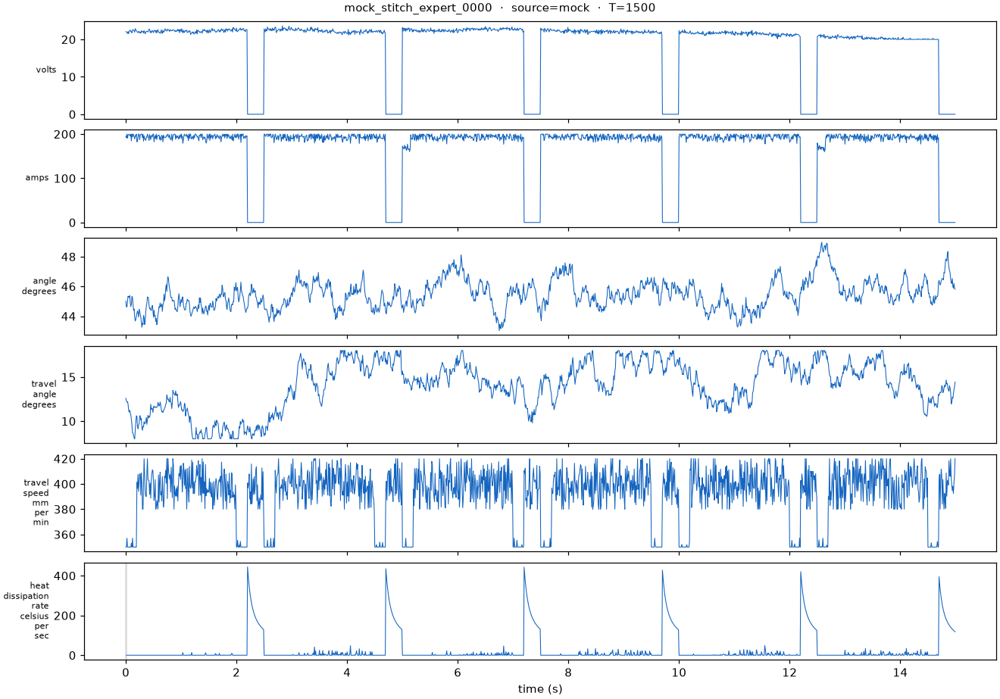
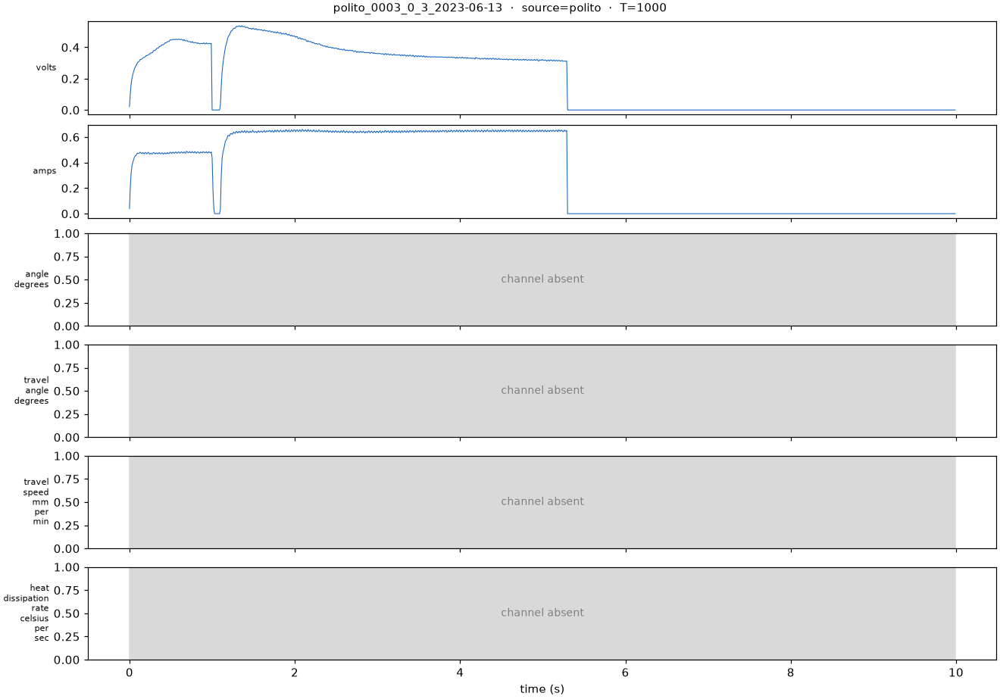
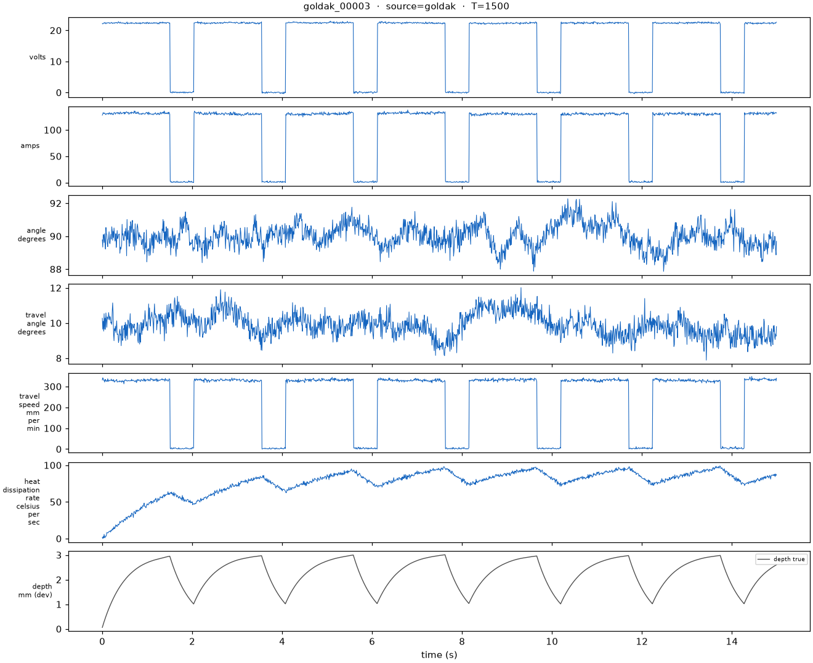

# world_model/ — the weld world model, from first principles

Working plan and step statuses: `STEPS.md` at repo root (single source of truth).
Gates and rationale: `FUTURE_PLANS_WORLD_MODELS.md`. This README explains the
*fundamentals* behind Steps 1–6 — what each piece is, and why it exists — for
someone who has never touched the subject.

## The problem, before any code

A weld is a physical process you can't see inside. The metal melts, fuses to a
certain **depth**, and solidifies — and that depth decides whether the joint
holds. But our sensors never measure it. They measure *side effects* at 100
frames per second: voltage, current, torch angle, travel angle, travel speed,
and heat-dissipation rate. Six numbers per frame, ~1500 frames per weld.

The whole project is one question: **can you recover the hidden state of a
physical process from its observable side effects?** Steps 1–6 don't answer it
— they build the equipment to answer it *honestly*. Every step pairs a
capability with an anti-self-deception mechanism, because the default outcome
of an ML project is fooling yourself with a leaked metric or a circular
validation.

```
Step 1  canonical tensors      ↔  session-level splits (no frame leakage)
Step 2  visualization          ↔  data bugs visible before any model exists
Step 3  a model                ↔  a boring baseline the fancy model must beat
Step 4  a simulator            ↔  a calibration gate before its data counts
Step 5  a feasibility number   ↔  GroupKFold + a kill criterion fixed in advance
Step 6  pretraining            ↔  a mean-predictor floor it had to beat
```

---

## Step 1 — Canonical schema, loaders, splits (`data/`)

A neural network doesn't eat "welds," it eats tensors — rectangular arrays of
numbers. So the first decision is: what is *the* shape of one weld?

**`schema.py` — `SessionTensor`.** One session is a matrix `x[T, 6]`: one
**row per moment** (100 rows/second), one **column per sensor**. A *channel*
is one column — the full time history of one measurement:

```
            volts   amps   angle  travel_ang  speed  heat_diss
t=0.00s   [ 22.1,  198.3,  45.2,     12.1,    398.0,    0.4 ]
t=0.01s   [ 22.3,  199.1,  45.0,     12.3,    401.2,    0.5 ]
  ...        ...     ...    ...       ...       ...      ...
t=14.99s  [  0.1,    0.2,  46.1,     14.8,    352.1,  118.9 ]
          — shape [T=1500, C=6]: 1500 moments × 6 sensors —
```

("6 channels = 6 dimensions" only in the bookkeeping sense: each row is a
point in a 6-dimensional space the way a spreadsheet row with six cells is.
Nothing spatial. A tensor's "dimensions" means its shape — `[T, 6]` is a 2-D
array whose second axis has size 6.)

Alongside `x` rides `mask[T, 6]`, a boolean matrix answering "is this cell
real?" per entry. Missingness is a first-class citizen of the format because
real sensors go missing: the Polito dataset carries 2 of our 6 channels, and a
field ESP32 may drop one. One mechanism handles it everywhere — batch padding
(`batch.py`) reuses the same mask, so padded frames and absent sensors are the
same case by construction.

**`loader_mock.py` / `loader_polito.py` / `loader_esp32.py`** are converters
*into* that format. Nothing downstream ever sees a raw format.

**`splits.py` — where the first self-deception lives.** You must score on data
the model never saw, but *how* you split matters: consecutive frames of one
weld are nearly identical (autocorrelation). If frames of weld #7 land in both
train and test, the model can "recognize weld #7" instead of learning welding,
and the score inflates. So we split by **session**, never by frame, using a
salted hash of the session ID — deterministic, so a session never migrates
between splits as the corpus grows (D9).

## Step 2 — Visualization, built early (`viz/timeline.py`)

Most data bugs are invisible in aggregate statistics and obvious to the eye —
a channel that's all zeros, a normalization applied twice, a reversed time
axis. So the eyes come before any model: `timeline.py` renders any
SessionTensor as **six stacked line plots sharing one time axis** — one
subplot per column of the matrix (that is all "plotting 6 channels" means).
Masked spans are greyed out so absent data is *visibly* absent, and overlay
rows can carry model outputs later (predicted depth, `z_phys` traces, risk
bands — dev only; no mm figures in any UI until Gate 5, D10).

On a good plot you can read the physics across subplots: in a stitch weld,
volts and amps drop to zero together at every stitch boundary, and the
heat-dissipation row spikes at exactly those moments — the weld pool dumping
heat the instant the arc stops feeding it. That cross-channel structure is
what the models must learn.



*Mock stitch-expert weld, all 6 channels present. Each subplot is one column
of `x[1500, 6]` against time. Volts and amps drop to zero together six times
(arc off between stitches), and every time they do, heat_dissipation spikes.*

The mask made visible — a real Polito weld, which carries only 2 of our 6
sensors:



*Real Polito spot weld #3. Same 6-row format, but 4 rows say "channel absent"
— mask=False, drawn grey so missing data is visibly missing rather than
silently zero. Note the volts/amps y-axis: 0–1, because the dataset authors
pre-normalized. Every data source flows through this one format; that is the
whole point of SessionTensor.*

## Step 3 — The GRU baseline (`baselines/`, `architecture/stems.py`)

Two fundamentals here — one about the model, one about method.

**What a stem is.** Raw channels have wildly different scales and meanings —
22 volts, 400 mm/min, 45 degrees. A **stem** is a small learned translator for
*one* channel: a `Conv1d` window sliding over 5 consecutive frames of that
single sensor, emitting 16 learned numbers per frame describing the local
motion (rising? spiking? flat?). One column `[T]` becomes `[T, 16]`.

```
volts [T] ──▶ stems["volts"] (Conv1d, k=5) ──▶ [T, 16]
amps  [T] ──▶ stems["amps"]  (Conv1d, k=5) ──▶ [T, 16]
angle — absent ──▶ stems["angle"] skipped (mask) ──▶ contributes nothing
                          │
        MEAN over channels present at each frame
                          ▼
                       [T, 16] ──▶ trunk
```

Two choices in that picture do all the work. **One stem per channel *name***:
the stems live in a `ModuleDict` keyed by string — six separate little
experts. That keying is the transfer mechanism (D5): Polito data only ever
exercises `stems["volts"]` and `stems["amps"]`, so exactly those two entries
carry real-data knowledge into the world model. **Mean, not sum**, over
available channels: a sum would make a 6-sensor frame's embedding three times
larger in magnitude than a 2-sensor frame's; a mean keeps them in the same
space regardless of sensor count.

**What a GRU is.** A weld is a *sequence* — order carries the information. A
recurrent network processes it by carrying a **hidden state** `h` (here 64
numbers) updated once per frame: `h_new = f(h_old, frame)`. Think of `h` as
working memory — a running summary of everything seen so far. A **GRU** (Gated
Recurrent Unit) is an update rule with *learned gates*: at each frame the
network decides how much old memory to keep and how much to overwrite. Without
gates, frame 10's memory washes out by frame 1500; gates let it hold "there
was a heat drop at second 3" for the rest of the weld. After the last frame,
`h_T` summarizes the whole weld and a linear head reads the quality class off
it.

**Why build the boring model first.** Never build the fancy thing without a
cheap opponent. The world model (controlled Latent ODE, physics losses,
counterfactuals) is months of work; a plain GRU classifier is days. If the
fancy thing can't beat the boring thing on the same data — same stems, same
tensors, so the fight is model-vs-model, not pipeline-vs-pipeline — you ship
the boring thing. Pre-registered as Gate 3. The baseline is the bar the world
model must clear to *earn its complexity*.

## Step 4 — The Goldak simulator (`simulator/`)

**The data problem:** zero real arc-welding sessions with known fusion depth
exist here. Ground truth means physically cutting welds open (sectioning
coupons) — slow, expensive, capped at dozens. Networks want thousands. The
classic escape: simulate.

**The physics:** welding is at its core a heat problem. Goldak's 1984 model
describes the arc as a **double-ellipsoid heat source** — a 3-D blob of power
injection, steeper in front, trailing behind, moving along the plate. Feed it
into the heat-conduction equation and you get the temperature field over time;
fusion depth falls out by definition (how deep does the melting-point region
reach?). The simulator emits full sessions: the 6 sensor channels *plus* the
hidden per-frame depth label no real sensor can provide. In a stitch weld the
depth trace saw-tooths — builds while the arc is on, decays while it's off:



*Simulated Goldak session #3. Same six channels on top — but the bottom row is
**depth true**: the fusion depth at every frame, known exactly because the
physics model computed it. This label is what Step 5's oracle predicts and is
scored against.*

**The trap it creates:** a simulator gives infinite labeled data *of the
simulator*, not of reality. Train on it, validate on it, and you've proven the
model can invert its own training data — circular. Hence Gate 1 (calibrate
against real sectioned coupons before the corpus counts) and the D10 rule (no
millimetre figure reaches any UI until Gate 5).

## Step 5 — Gate 1.5, the observability ceiling (`eval/probes.py`)

The most fundamental question, asked *before* committing months: **is fusion
depth even recoverable from these six channels?** Information-theoretically:
if two welds with different depths produce indistinguishable sensor streams,
no architecture can tell them apart — model capacity cannot create information
absent from the input.

**The oracle trick:** to measure the *ceiling* rather than any one model's
skill, make the problem as easy as possible and see if it's solvable at all.
Simulated data (truth known), 100-frame windows, hand-computed features, a
gradient-boosted tree — a strong, cheap, zero-tuning learner given every
advantage. Its predictions are scored against the simulator's own depth row.
If even the pampered oracle fails, the signal isn't there, and the project
stops before the expensive part. That's what a **gate** is: a kill criterion
fixed before seeing results, so a bad number can't be rationalized afterward.

**The subtle trap, leakage again:** overlapping windows from one session are
near-duplicates; ordinary cross-validation scatters them across folds and the
oracle "recognizes the session" — a false green light on the plan's most
important number. Hence **GroupKFold by session**: whole sessions stay in one
fold.

**Result (see `experiments/gate_status.md`):** oracle MAE **0.109 mm** vs a
1.0 mm threshold (mean-predictor baseline 0.66 mm) → PASS. Deliberately a
"mini-gate": cheap and knowingly circular (model of the simulator, judged by
the simulator), which is legitimate for the one question it asks — *do the
channels carry the signal at all?* A mini-gate buys an early, cheap **no**;
only real coupons (Gates 1/5) can buy the expensive **yes**. The 0.109 mm
ceiling is provisional until Gate 1 calibration.

## Step 6 — Gate 0.5, Polito pre-training (`training/pretrain_polito.py`)

**The problem it solves:** mock data is *too clean* — a model can ace it and
fall over on real arc noise. The repo's only real sensor data is Polito:
1,976 industrial spot welds (voltage, current, force; 79 faulty). It's the
wrong process (spot, not arc) with 2 of our 6 channels, so it cannot train the
final model. Its job is a **warm start**: teach the stems and trunk what real
electrical dynamics look like, then reuse those weights when the world model
trains (Step 8). This is the standard pretrain→fine-tune recipe (BERT, wav2vec,
ImageNet transfer): gradient descent from a random start on scarce data
overfits; pretraining on plentiful *related* data moves the weights to a
region where fine-tuning only has to adjust.

**How it trains,** jointly:
- **Masked reconstruction** — hide 15% of timesteps, reconstruct the sensor
  values at the hidden frames from the trunk's hidden state. The time-series
  version of BERT's masked-word objective; no labels needed; forces the trunk
  to model temporal structure.
- **Fault bit** — one logit per weld, BCE with `pos_weight = n_good/n_faulty`
  (≈24), else the model wins by always answering "good" (79 vs 1,897).

**What transfers:** exactly `{stems["volts"], stems["amps"], trunk}` — the
dictionary keying from Step 3 doing its job. The trunk is a single-layer GRU
whose weights are shape-identical to the `GRUCell` inside Step 7's ODE-RNN
encoder (pinned by a test). The recon and fault heads are pretrain-only
scaffolding and are excluded. No input normalization: Polito arrives
pre-normalized [0,1]; standardizing with statistics the ESP32 path can't
reproduce would poison the transfer.

**Result (see `experiments/gate_status.md`):** held-out masked-recon MSE
**0.00083** vs **0.0743** for the mean predictor (~90×) → the kill criterion
("pipeline can't learn real electrical dynamics at all") cleared. The fault
head is honest-but-weak (macro-F1 0.14 under the imbalance) — recorded, and
irrelevant to the warm start since it doesn't transfer. Artifact:
`experiments/checkpoints/polito_pretrain_8a68998bf644.pt`.

---

## Where this leaves the plan

Steps 1–6 done; both cheap gates passed with pre-registered criteria. Next in
code: Step 7 (the **controlled** Neural ODE — `dz/dt = f_θ(z, u(t), t)`, where
`u(t)` is the interpolated control channels; autonomous `f_θ(z, t)` would make
counterfactuals architecturally impossible) and Step 8 (training loop,
warm-started from the Step 6 artifact). Steps 9+ are blocked on Gate 0 — real
data collection (30 sessions + 8 sectioned coupons), the longest lead time in
the plan and the only thing no amount of code substitutes for.

Evidence discipline (D11): every run appends to `experiments/runs.csv`; every
gate outcome is recorded in `experiments/gate_status.md` as number vs
threshold, or it didn't happen.
